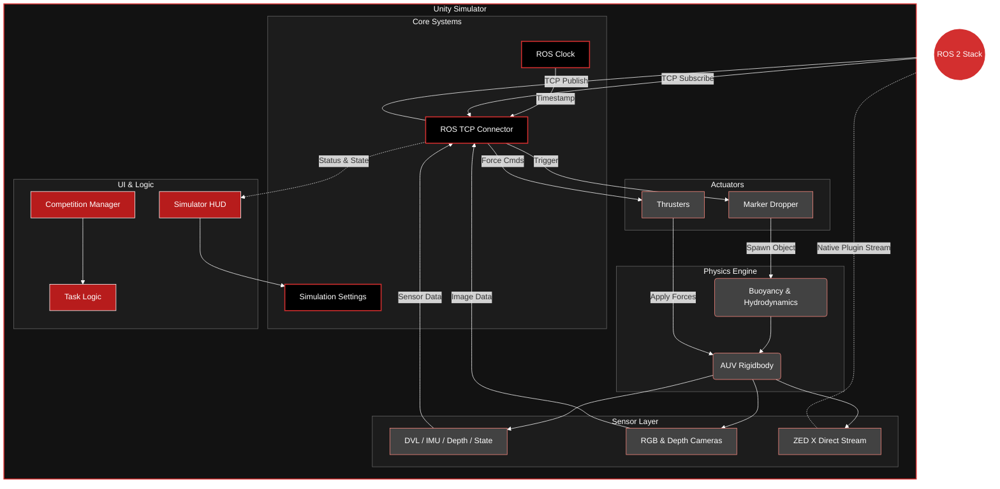

# McGill Robotics AUV Simulator (Unity)

This repository contains the Unity-based simulator for the McGill Robotics Autonomous Underwater Vehicle (AUV), "Diana". The simulator provides a physics-based environment for testing control systems, computer vision algorithms, and mission planning logic without requiring hardware deployment.

It communicates with the ROS software stack via TCP, simulating sensors (IMU, DVL, Depth, Hydrophones, and ZED Cameras) and receiving thruster commands.

## Current Status

**Version:** Unity 6 (6000.0.62f1)
**Architecture:** Component-based ROS Bridge with UI Toolkit

**Known Issues:**
*   **ROS Synchronization:** Ensure the ROS TCP Endpoint matches the IP/Port configurations in the Unity Editor.
*   **Performance:** There is still some optimization to be done.

## Architecture

The simulator is built on a modular architecture designed to decouple Unity physics from ROS communication.




### 1. Core Systems (`Scripts/Core`)
*   **SimulationSettings:** A singleton that persists user preferences (resolution, sensor toggles, quality settings) across sessions.
*   **ROSSettings:** Centralized registry for all ROS topic names and frame IDs.
*   **ROSClock:** Synchronizes simulation time with ROS time, ensuring timestamp accuracy for sensor fusion.
*   **CameraManager:** Orchestrates the activation/deactivation of camera publishers to optimize performance.
*   **InputManager:** Manages manual control overrides and keybindings.

### 2. Sensor Abstraction (`Scripts/Sensors`)
All sensors inherit from the abstract `ROSPublisher` class.
***Implemented Sensors:**
*   **DVL:** Simulates 4-beam Janus acoustics with bias/noise. Publishes `TwistWithCovarianceStamped`.
*   **IMU:** Publishes `sensor_msgs/Imu` (Accel, Gyro, Orientation). Supports EKF orientation covariance.
*   **Depth:** Publishes `std_msgs/Float64` metric depth (positive-down).
*   **Ground Truth:** Detailed state publishing (`Twist`, `Accel`, `Orientation`) at the AUV center of mass for validation.
*   **Hydrophones:** Simulates pinger bearing and time-difference-of-arrival (TDOA).
*   **Cameras:** Publishes `sensor_msgs/Image` and `CameraInfo` for front and downward views.
*   **ZED X:** Native bridge support via `ZED2iSimSender` for hardware-in-the-loop testing with the ZED SDK.

### 3. Actuation (`Scripts/Actuators`)
*   **Thrusters:** Subscribes to `ThrusterForces`. Converts Newton commands into Rigidbody forces applied at specific mount points relative to the CoM.
*   **Dropper:** Handles the mechanism for releasing markers during competition tasks.
*   **Torpedo Launcher:** Rotatable base with two-stage launch and reset logic.

### 4. User Interface (`Scripts/UI`)
The simulator uses **UI Toolkit** (UXML/USS) for the Heads-Up Display.
*   **SimulatorHUD:** Main coordinator for drawers, logging, and Update loop.
*   **Moduar Controllers:** Dedicated handlers for `Settings` (Config), `Telemetry` (AUV State), `Camera Feeds`, `Sensor Data`, and `Belief Visualization` (EKF/SLAM markers).

## Project Structure

```
Assets/
├── _Project/                    # All custom simulator code and assets
│   ├── Scripts/
│   │   ├── Core/                # Managers & Singletons (ROSSettings, Clock, Input)
│   │   ├── Sensors/             # ROS Publishers & ZED Interface
│   │   ├── Actuators/           # Thrusters, Dropper, Torpedo Launcher
│   │   ├── Physics/             # Buoyancy & Hydrodynamics
│   │   ├── UI/                  # HUD Controllers & Logic
│   │   ├── Utils/               # Helpers (Visualization, Math)
│   │   ├── CompetitionSettings/ # Task-specific logic & scoring
│   │   ├── SynthDataGen/        # Synthetic data generation for ML
│   │   ├── UserCamera/          # Freecam & Orbit controls
│   │   ├── AudioSettings/       # Audio configuration
│   │   └── PointsSettings/      # Scoring & points logic
│   ├── UI/                      # UI Toolkit Assets (.uxml, .uss)
│   ├── Scenes/                  # Unity Scenes (Pools, Tests)
│   ├── Prefabs/                 # AUV parts, Props, Gates
│   ├── Models/                  # 3D Models & imports
│   ├── Materials/               # Custom materials
│   ├── Textures/                # Texture assets
│   ├── Shaders/                 # Custom shaders
│   ├── Audio/                   # Sound effects
│   └── Resources/               # Runtime-loaded assets
├── RosMessages/                 # Generated C# ROS message classes
├── 3rdParty/                    # External assets (SkySeries, TextMesh Pro)
├── Plugins/                     # Native plugins (ZED SDK binaries)
└── Settings/                    # Project render & quality settings
```

### Prerequisites
* **Unity Hub**
* **Unity Editor:** Version `6000.0.62f1` LTS (Unity 6).
* **ROS 2:** (Required for the ROS-TCP-Endpoint).

### ⚠️ Important: ZED SDK & Plugin Setup (not tested on Windows, ignore if not using ZED SDK)
The simulator relies on the ZED SDK. Due to GitHub file size limits, the required binary files (`.dll` and `.so`) are **NOT** included in the repository.

**You must follow these steps or the project will have compile errors:**

1.  **Install ZED Drivers:**
    You must install the **ZED SDK (v5.1)** on your computer for the camera drivers to work.
    * [Download ZED SDK Here](https://www.stereolabs.com/developers/release/)

2.  **Add Missing Binaries:**
    1.  Download both `libsl_zed.so` and `sl_zed64.dll` from our Drive: [zed-bridge-plugin folder](https://drive.google.com/drive/folders/1vSMmt-lHEBNJbQY0uOj_WAM2HUnHQQhL?usp=drive_link)
    2.  Drag the `libsl_zed.so` and `sl_zed64.dll` files into your Unity project at this path:
        `auv-sim-unity/Assets/Plugins/`
    4.  *Note: If asked, overwrite any existing files.*

_The links to download these files were found in the [zed-isaac-sim](https://github.com/stereolabs/zed-isaac-sim) plugin github repo, more specifically in `build.sh` & `build.bat` scripts._

### Setup Steps
1.  Clone the repository.
2.  **Perform the ZED Plugin Setup (see above).**
3.  Open the project via Unity Hub.
4.  Allow Unity to import assets and compile scripts.
5.  Navigate to the top menu `Robotics -> ROS Settings` and ensure the IP address matches your ROS machine (or `127.0.0.1` if running locally).

### ROS Setup

1.  **Launch ROS TCP Endpoint**
    ```bash
    # Build ROS workspace
    source /opt/ros/humble/setup.bash
    cd <AUV-2026>/ros2_ws
    colcon build --symlink-install
    
    # Source the workspace
    source install/setup.bash

    # Launch endpoint
    ros2 launch ros_tcp_endpoint endpoint.py
    ```

2.  **Verify Connection**
    - In Unity: Press Play. The ROS Settings menu should show a green "Connected" status.
    - In Terminal: You should see logs indicating registration of publishers (e.g., RegisterPublisher(/sensors/dvl/data, ...)).

3.  **Visualize Data**
    To verify data is flowing correctly:
    Check Sensor Data:
    ```bash
    ros2 topic list
    ros2 topic echo /sensors/dvl/data --once
    ros2 topic echo /sensors/imu/data --once
    ros2 topic echo /sensors/depth --once
    ```

    View Camera Feeds:
    To view the RGB or Depth streams, use rqt_image_view (requires X11 forwarding enabled in Docker):
    ```bash
    ros2 run rqt_image_view rqt_image_view
    ```

## Workflows

### Running a Simulation
1.  Open the scene `Assets/_Project/Scenes/25x50Pool.unity`.
2.  Press **Play**.
3.  The **Simulator HUD** will appear. Use the left panel to toggle specific sensors or adjust camera framerates.
4.  Click **Apply Configuration** to save changes.

### Manual Control
When the simulator is running, you can manually override ROS commands using the keyboard:

*   **Surge (Forward/Back):** W / S
*   **Sway (Left/Right):** A / D
*   **Heave (Up/Down):** E / Q
*   **Yaw (Turn):** J / L
*   **Pitch:** I / K
*   **Roll:** U / O
*   **Emergency Stop:** Spacebar (Toggles Kinematic freeze)
*   **Drop Marker:** G
*   **Rotate Torpedo Launcher:** Left and Right Arrow Keys
*   **Shoot Torpedo/Reset:** T / Y
*   **Toggle Camera Mode:** C

### Competition Logic (TODO)
The simulator includes a `CompetitionManager` that orchestrates specific tasks (e.g., Gate, Buoy, Bins).
1.  In the HUD, select the desired task from the dropdown.
2.  Click **Initiate Run**.
3.  The simulator will reset the AUV and props to the starting configuration for that task.

### Unity Editor Tips

**Set Aspect Ratio:**
In the **Game** tab, click the dropdown showing "Free Aspect" and change it to **16:9** for a normal screen ratio.

**Check FPS & Performance:**
Click on **Stats** in the top-right corner of the **Game** tab to view the current framerate and rendering statistics.

**Modify ROS Topic Names:**
1.  In the **Hierarchy** panel, click on `Managers-Configurations`.
2.  In the **Inspector** panel on the right, scroll down to find the `ROS Settings` component.
3.  Edit the topic name fields directly.

**Modify Simulation Settings:**
1.  Click on `Managers-Configurations` in the **Hierarchy**.
2.  In the **Inspector**, find the `Simulation Settings` component.
3.  Toggle sensors, adjust camera resolutions, and configure other options.
4.  **Note:** Some changes require you to **Stop** the simulation, modify the settings, and **Play** again. Alternatively, use the in-game HUD and click **Save & Restart**.

**Modify Sensor Parameters:**
Sensors are located under `Douglas > Sensors` in the **Hierarchy**. Each sensor has its own script attached:
| GameObject | Script |
| :--- | :--- |
| `ZED2i (Stereo Camera)` | `CameraPublisher`, `CameraDepthPublisher`, `ZED2iSimSender` |
| `Down Cam` | `CameraPublisher` |
| `Movella MTI-600 (IMU)` | `IMUPublisher` |
| `DVL-A50` | `DVLPublisher` |
| `Pressure Sensor (Depth)` | `DepthPublisher` |
| `Hydrophones` | `PingerBearingVisualizer`, `PingerTimeDifference` (TODO) |

**Modify Actuator Parameters:**
Actuators are located under `Douglas > Actuators` in the **Hierarchy**:
| GameObject | Script |
| :--- | :--- |
| `Thrusters` | `Thrusters` |
| `Grabber` | *(TODO: script not yet implemented)* |
| `Torpedo Launcher` | `TorpedoLauncher` |

**Modify AUV Physics:**
Select the `Douglas` GameObject in the **Hierarchy** to access physics components:
*   **Rigidbody:** Mass, drag, and angular drag.
*   **Buoyancy:** Center of buoyancy offset and buoyancy force.
*   **Drag:** Hydrodynamic drag coefficients.
*   **GroundTruthPublisher:** Ground truth state publishing.

## ROS Interface

The simulator communicates over the following default topics (configurable in `ROSSettings.cs`):

**Publishers (Sim -> ROS):**

| Topic | Description | Frame / Convention | Message Type |
| :--- | :--- | :--- | :--- |
| `/auv/ground_truth/twist` | Ground truth linear/angular velocity | **Unity** (X-Right, Y-Up, Z-Fwd) + RH Rule | `TwistStamped` |
| `/auv/ground_truth/accel` | Ground truth linear/angular acceleration | **Unity** (X-Right, Y-Up, Z-Fwd) + RH Rule | `AccelStamped` |
| `/sensors/dvl/data` | Doppler Velocity Log (A50) | **FRD** (+X Fwd, +Y Right, +Z Down) | `TwistWithCovarianceStamped` (DvlMsg in the future) |
| `/sensors/imu/data` | IMU Orientation, Gyro, and Accel | **FLU** (+X Fwd, +Y Left, +Z Up) + RH Rule | `Imu` |
| `/sensors/depth/data` | Vertical Depth | **Positive Down** (+Z Down) | `Float64` |
| `/sensors/camera/front/image_raw` | Front RGB Camera (raw) | Optical Frame | `Image` |
| `/sensors/camera/front/image_raw/compressed` | Front RGB Camera (JPEG) | Optical Frame | `CompressedImage` |
| `/sensors/camera/front/depth_raw` | Front Depth Map (always raw) | Optical Frame | `Image` |
| `/sensors/camera/down/image_raw` | Downward RGB Camera (raw) | Optical Frame | `Image` |
| `/sensors/camera/down/image_raw/compressed` | Downward RGB Camera (JPEG) | Optical Frame | `CompressedImage` |

> [!NOTE]
> **JPEG Compression (enabled by default):** When enabled, only the `/compressed` topics are published for RGB cameras. The raw `image_raw` topics are not published. Disable JPEG compression in `SimulationSettings` to publish raw images instead. The depth map is always published as raw (no compression).

**Subscribers (ROS -> Sim):**

| Topic | Description | Message Type |
| :--- | :--- | :--- |
| `/auv/thruster_forces` | Individual thruster force commands (8 thrusters) | `ThrusterForces` |
| `/auv/dropper/trigger` | Trigger for the dropper mechanism | `Bool` |
| `/auv/torpedo/launch` | Trigger for torpedo launch | `Bool` |
| `/auv/torpedo/rotate` | Torpedo launcher rotation angle | `Float32` |

## Roadmap & TODO

**Priority 1: Sensor Verification**
*   [ ] **Sensor Validation:** Rigorously test all sensor outputs (DVL, IMU, Depth) against Unity ground truth.
*   [ ] **Frame of Reference:** Verify that all coordinate conversions (Unity Left-Handed --> ROS FLU) are mathematically correct.
*   [ ] **Frame IDs:** Ensure `frame_id` fields in ROS messages match the TF tree expected by the ROS stack.

**Priority 2: Critical Fixes**
*   [X] **ZED Bridge IMU:** Fix the IMU data transformation in `ZED2iSimSender`. Currently, sending rotational data breaks the ZED SDK's positional tracking loop.

**Priority 3: Usability & Workflow**
*   [ ] **Modular Camera Modes:** Implement presets in `SimulationSettings` to quickly toggle specific configurations:
    *   Down-Cam only (navigation testing).
    *   Front-Left only (YOLO/Object detection).
    *   Stereo Front (VIO/SLAM).

**Priority 4: Competition Logic**
*   [ ] **Task State Machines:** Finalize the internal logic for individual tasks (Gate, Buoy, Bins, Octagon).
*   [ ] **End-to-End Workflow:** Validate the full competition run flow via `CompetitionManager`, ensuring tasks reset and score correctly.

**Priority 5: Integration**
*   [ ] **ROS Integration:** Audit `ROSSettings.cs` against the external ROS 2 codebase. Ensure all topic strings and message definitions match exactly.

**Priority 6: Documentation**
*   [ ] **Architecture:** Document the new UI Toolkit structure (`.uxml`, `.uss`, and bindings) and the Core Manager pattern.
*   [ ] **Sensor Models:** Document the math behind the DVL acoustics simulation and IMU noise models.
*   [X] **Setup Guide:** specific instructions for configuring the Unity 6 environment.

