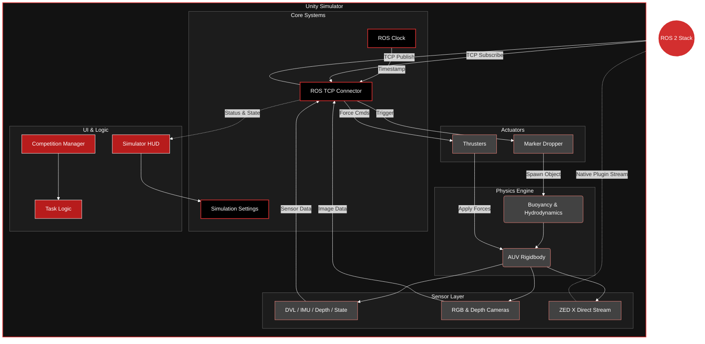

# McGill Robotics AUV Simulator (Unity)

This repository contains the Unity-based simulator for the McGill Robotics Autonomous Underwater Vehicle (AUV), "Diana". The simulator provides a physics-based environment for testing control systems, computer vision algorithms, and mission planning logic without requiring hardware deployment.

It communicates with the ROS software stack via TCP, simulating sensors (IMU, DVL, Depth, Hydrophones, and ZED Cameras) and receiving thruster commands.

## Current Status

**Version:** Unity 6 (6000.0.62f1)
**Architecture:** Component-based ROS Bridge with UI Toolkit

**Recent Changes:**
*   Migrated project to Unity 6.
*   Replaced legacy GUI with Unity UI Toolkit for improved performance and modularity.
*   Implemented native ZED X camera streaming via `ZED2iSimSender` to interface directly with the ZED SDK Bridge.
*   Refactored sensor architecture into a modular `ROSPublisher` inheritance system.
*   Centralized configuration via singleton Managers.

**Known Issues:**
*   **ZED IMU:** Rotational data sent to the ZED Bridge currently causes tracking instability.
*   **ROS Synchronization:** Ensure the ROS TCP Endpoint matches the IP/Port configurations in the Unity Editor.
*   **Performance:** There is a lot of potential optimization to be done.

## Architecture

The simulator is built on a modular architecture designed to decouple Unity physics from ROS communication.

### 1. Core Systems (`Scripts/Core`)
*   **SimulationSettings:** A singleton that persists user preferences (resolution, sensor toggles, quality settings) across sessions.
*   **ROSSettings:** Centralized registry for all ROS topic names and frame IDs.
*   **ROSClock:** Synchronizes simulation time with ROS time, ensuring timestamp accuracy for sensor fusion.
*   **InputManager:** Manages manual control overrides and keybindings.

### 2. Sensor Abstraction (`Scripts/Sensors`)
All sensors inherit from the abstract `ROSPublisher` class. This base class handles:
*   Publishing frequency/rate throttling.
*   Global on/off toggles via `SimulationSettings`.
*   Standardized `FixedUpdate` loops for physics consistency.

**Implemented Sensors:**
*   **DVL:** Publishes `VelocityReportMsg` (Surge/Sway/Heave velocities and Altitude).
*   **IMU:** Publishes `ImuMsg` with simulated noise and bias models.
*   **Cameras:** `CameraPublisher` and `CameraDepthPublisher` utilize RenderTextures and Compute Shaders to efficiently output RGB and 32-bit float Depth images.
*   **ZED X:** Uses `ZED2iSimSender` and native plugins (`libsl_zed.so` / `sl_zed64.dll`) to emulate the ZED hardware stream directly.

### 3. Actuation (`Scripts/Actuators`)
*   **Thrusters:** Subscribes to `ThrusterForcesMsg`. Converts Newton force commands into Unity Rigidbody forces applied at specific mount points relative to the Center of Mass.
*   **Dropper:** Handles the mechanism for releasing markers during competition tasks.

### 4. User Interface (`Scripts/UI`)
The simulator uses **UI Toolkit** (UXML/USS) for the Heads-Up Display (`SimulatorHUD`).
*   **Settings Panel:** Live configuration of sensor publishing, resolution, and graphics quality.
*   **Telemetry:** Real-time visualization of AUV pose, velocity, and mission status.
*   **Visual Feed:** Debug views for camera streams and depth maps.

## Installation & Setup

### Prerequisites
* **Unity Hub**
* **Unity Editor:** Version `6000.0.62f1` LTS (Unity 6).
* **ROS 2:** (Required for the ROS-TCP-Endpoint).

### ⚠️ Important: ZED SDK & Plugin Setup
The simulator relies on the ZED SDK. Due to GitHub file size limits, the required binary files (`.dll` and `.so`) are **NOT** included in the repository.

**You must follow these steps or the project will have compile errors:**

1.  **Install ZED Drivers:**
    You must install the **ZED SDK (v5.1)** on your computer for the camera drivers to work.
    * [Download ZED SDK Here](https://www.stereolabs.com/developers/release/)

2.  **Add Missing Binaries:**
    1.  Download both `libsl_zed.so` and `sl_zed64.dll` from our Drive: [zed-bridge-plugin folder](https://drive.google.com/drive/folders/1vSMmt-lHEBNJbQY0uOj_WAM2HUnHQQhL?usp=drive_link)
    2.  Drag the `libsl_zed.so` and `sl_zed64.dll` files into your Unity project at this path:
        `auv-sim-unity/Assets/Plugins/`
    4.  *Note: If asked, overwrite any existing files.*

_The links to download these files were found in the [zed-isaac-sim](https://github.com/stereolabs/zed-isaac-sim) plugin github repo, more specifically in `build.sh` & `build.bat` scripts._

### Setup Steps
1.  Clone the repository.
2.  **Perform the ZED Plugin Setup (see above).**
3.  Open the project via Unity Hub.
4.  Allow Unity to import assets and compile scripts.
5.  Navigate to the top menu `Robotics -> ROS Settings` and ensure the IP address matches your ROS machine (or `127.0.0.1` if running locally).

### ROS Setup
_**TODO**_

## Workflows

### Running a Simulation
1.  Open the scene `Assets/Scenes/Refactoring-Pool.unity` (or the relevant competition scene).
2.  Press **Play**.
3.  The **Simulator HUD** will appear. Use the left panel to toggle specific sensors or adjust camera framerates.
4.  Click **Apply Configuration** to save changes.

### Manual Control
When the simulator is running, you can manually override ROS commands using the keyboard:

*   **Surge (Forward/Back):** W / S
*   **Sway (Left/Right):** A / D
*   **Heave (Up/Down):** E / Q
*   **Yaw (Turn):** J / L
*   **Pitch:** I / K
*   **Roll:** U / O
*   **Emergency Stop:** Spacebar (Toggles Kinematic freeze)
*   **Drop Marker:** G
*   **Toggle Camera Mode:** C

### Competition Logic
The simulator includes a `CompetitionManager` that orchestrates specific tasks (e.g., Gate, Buoy, Bins).
1.  In the HUD, select the desired task from the dropdown.
2.  Click **Initiate Run**.
3.  The simulator will reset the AUV and props to the starting configuration for that task.
4.  Scoring is automated via collision triggers and alignment checks implementing the `ICompetitionTask` interface.

## ROS Interface

The simulator communicates over the following default topics (configurable in `ROSSettings.cs`):

**Publishers (Sim -> ROS):**
*   `/auv/state`: Ground truth state (Position/Velocity).
*   `/sensors/dvl/data`: Doppler Velocity Log data.
*   `/sensors/imu/data`: IMU data (Accel/Gyro).
*   `/sensors/depth`: Depth sensor reading.
*   `/sensors/camera/front/image_raw`: Front camera RGB.
*   `/sensors/camera/depth/image_raw`: Front camera Depth.
*   `/down_cam/image_raw`: Downward facing camera.

**Subscribers (ROS -> Sim):**
*   `/auv/thruster_forces`: Individual thruster commands (Newtons).
*   `/auv/dropper`: Bool trigger for the dropper mechanism.

## Roadmap & TODO

**Priority 1: Sensor Verification**
*   [ ] **Sensor Validation:** Rigorously test all sensor outputs (DVL, IMU, Depth) against Unity ground truth.
*   [ ] **Frame of Reference:** Verify that all coordinate conversions (Unity Left-Handed --> ROS FLU) are mathematically correct.
*   [ ] **Frame IDs:** Ensure `frame_id` fields in ROS messages match the TF tree expected by the ROS stack.

**Priority 2: Critical Fixes**
*   [ ] **ZED Bridge IMU:** Fix the IMU data transformation in `ZED2iSimSender`. Currently, sending rotational data breaks the ZED SDK's positional tracking loop.

**Priority 3: Usability & Workflow**
*   [ ] **Modular Camera Modes:** Implement presets in `SimulationSettings` to quickly toggle specific configurations:
    *   Down-Cam only (navigation testing).
    *   Front-Left only (YOLO/Object detection).
    *   Stereo Front (VIO/SLAM).

**Priority 4: Competition Logic**
*   [ ] **Task State Machines:** Finalize the internal logic for individual tasks (Gate, Buoy, Bins, Octagon).
*   [ ] **End-to-End Workflow:** Validate the full competition run flow via `CompetitionManager`, ensuring tasks reset and score correctly.

**Priority 5: Integration**
*   [ ] **ROS Integration:** Audit `ROSSettings.cs` against the external ROS 2 codebase. Ensure all topic strings and message definitions match exactly.

**Priority 6: Documentation**
*   [ ] **Architecture:** Document the new UI Toolkit structure (`.uxml`, `.uss`, and bindings) and the Core Manager pattern.
*   [ ] **Sensor Models:** Document the math behind the DVL acoustics simulation and IMU noise models.
*   [ ] **Setup Guide:** specific instructions for configuring the Unity 6 environment.

## Directory Structure

*   **Assets/Scripts/Core:** Managers and Singletons.
*   **Assets/Scripts/Sensors:** ROS publishing logic and ZED interface.
*   **Assets/Scripts/Actuators:** Thrusters and physical manipulators.
*   **Assets/Scripts/Physics:** Hydrodynamics and buoyancy.
*   **Assets/Scripts/UI:** UI Toolkit scripts and view logic.
*   **Assets/Scripts/CompetitionSettings:** Task-specific logic and scoring.
*   **Assets/RosMessages:** Generated C# classes for ROS messages.
*   **Assets/UI:** `.uxml` layouts and `.uss` stylesheets.
